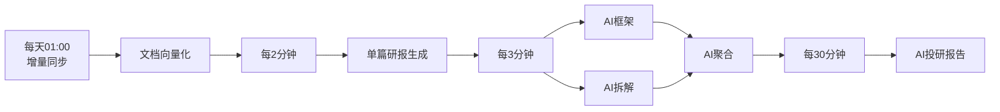

# Wind.Stock.AIResearchFramework.Service

> AI 投研框架服务（AI Research Framework Service）

---

# 项目简介

`Wind.Stock.AIResearchFramework.Service` 是 AI 投研平台核心服务，负责研报筛选、向量化、AIGC 生成、研报拆解、内容聚合及定时调度等能力，为 SmartRead、DataProcess 等业务系统提供统一的 AI 投研服务。

主要功能：

- 研报筛选
- 文档向量化
- AI 框架生成
- AI 拆解生成
- AI 聚合生成
- Prompt 管理
- 调度中心
- AI 内容存储

---

# 项目目录

```text
Wind.Stock.AIResearchFramework.Service
│
├── src
│   ├── main
│   │
│   ├── java
│   │   └── com.wind.stock.airesearch
│   │
│   │       ├── config                 # Spring Boot 配置
│   │       ├── controller             # REST API
│   │       ├── service                # 业务接口
│   │       ├── service.impl           # 业务实现
│   │       ├── scheduler              # 定时调度
│   │       ├── vector                 # 向量化模块
│   │       ├── aigc                   # AI生成模块
│   │       ├── report                 # 研报生成
│   │       ├── framework              # 研报框架生成
│   │       ├── split                  # 研报拆解
│   │       ├── aggregate              # AI聚合
│   │       ├── prompt                 # Prompt管理
│   │       ├── repository             # DAO层
│   │       ├── mapper                 # MyBatis Mapper
│   │       ├── entity                 # 实体对象
│   │       ├── dto                    # 请求对象
│   │       ├── vo                     # 返回对象
│   │       ├── enums                  # 枚举
│   │       ├── constant               # 常量
│   │       ├── exception              # 异常处理
│   │       ├── util                   # 工具类
│   │       └── AIResearchApplication.java
│   │
│   └── resources
│       ├── application.yml
│       ├── mapper
│       ├── logback.xml
│       └── static
│
├── docs                              # 项目文档
├── scripts                           # SQL、Shell脚本
├── pom.xml
├── README.md
└── .gitignore
```

---

# 目录说明

| 模块 | 说明 |
|------|------|
| config | Spring Boot、Redis、数据库等配置 |
| controller | 对外 REST API |
| service | 业务接口 |
| service.impl | 业务实现 |
| scheduler | 定时调度任务 |
| vector | 文档向量化 |
| aigc | AI 模型调用 |
| report | 研报生成 |
| framework | AI 框架生成 |
| split | AI 研报拆解 |
| aggregate | AI 内容聚合 |
| prompt | Prompt 管理 |
| repository | Repository 数据访问层 |
| mapper | MyBatis Mapper |
| entity | 数据实体 |
| dto | 请求对象 |
| vo | 返回对象 |
| enums | 枚举定义 |
| constant | 常量 |
| exception | 全局异常处理 |
| util | 工具类 |
| resources | 配置文件、Mapper XML、日志等 |
| docs | 项目文档 |
| scripts | SQL、部署脚本 |

---

# 模块职责

## Report（研报筛选）

负责：

- 查询研报列表
- 根据 PlanType 选择研报
- 年报补充
- 企业自有文档补充

---

## Vector（向量化）

负责：

- 文档解析
- Chunk 切分
- Embedding 生成
- 向量库存储

---

## Framework（研报框架）

负责：

- 向量召回
- Prompt 调用
- AI 框架生成
- AI 内容存储

---

## Split（研报拆解）

负责：

- 文档拆分
- AI 拆解
- AI 内容合并
- 内容存储

---

## Aggregate（聚合）

负责：

- 汇总多个 AI 结果
- 聚合生成最终投研报告

---

## Scheduler（调度）

负责：

| 调度任务 | 周期 |
|----------|------|
| 文档向量化 | 每2分钟 |
| 单个研报生成 | 每3分钟 |
| 汇总生成 | 每30分钟 |
| 增量同步 | 每天01:00 |

---

# 系统架构

```text
                +----------------+
                | Scheduler      |
                +--------+-------+
                         |
      +------------------+------------------+
      |                  |                  |
      ▼                  ▼                  ▼
  Report            Vector            AI Generate
 (筛选)             (向量化)         (框架/拆解)
      \                |               /
       \               |              /
        +--------------+-------------+
                       |
                 Aggregate
                 (内容聚合)
                       |
                       ▼
                 AI Research Report
```

---

# 技术栈

- Java 17
- Spring Boot
- Spring MVC
- MyBatis
- Redis
- MySQL
- Elasticsearch / Milvus（向量检索）
- OpenAI / DeepSeek（AIGC）
- Maven
- XXL-JOB（可选）
- Logback

---

# 调度关系



---

# 服务职责

AIResearchFramework.Service 负责整个 AI 投研生命周期管理，包括：

- 数据同步
- 文档筛选
- 文档向量化
- AI 框架生成
- AI 拆解
- AI 聚合
- 定时调度
- AI 内容存储
- 对外 API 服务
